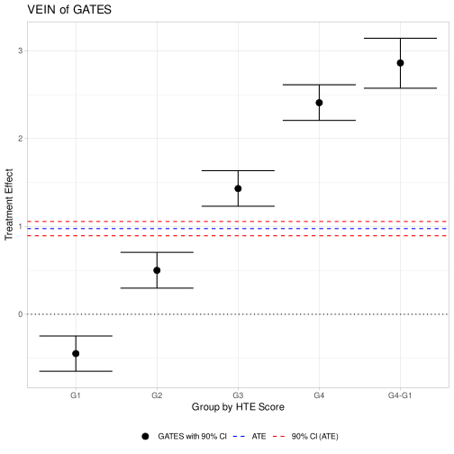
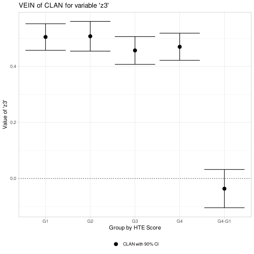

# GenericML: Generic Machine Learning Inference

[](https://www.gnu.org/licenses/gpl-3.0)
[](https://github.com/mwelz/GenericML/actions)
[](https://cran.r-project.org/package=GenericML)
[](https://cran.r-project.org/package=GenericML)

To cite `GenericML` in publications, please use:

> Welz M., Alfons, A., Demirer, M. and Chernozhukov, V. (2021). `GenericML`: Generic Machine Learning Inference. `R` package version 0.1.1. URL: https://CRAN.R-project.org/package=GenericML.


## Summary

`R` implementation of Generic Machine Learning Inference on heterogeneous treatment effects in randomized experiments as proposed in [Chernozhukov, Demirer, Duflo and Fernández-Val (2020)](https://arxiv.org/abs/1712.04802). This package's workhorse is the `mlr3` framework of [Lang et al. (2019)](https://joss.theoj.org/papers/10.21105/joss.01903), which enables the specification of a wide variety of machine learners. The main functionality, `GenericML()`, runs Algorithm 1 in [Chernozhukov, Demirer, Duflo and Fernández-Val (2020)](https://arxiv.org/abs/1712.04802) for a suite of user-specified machine learners. All steps in the algorithm are customizable via setup functions. Methods for printing and plotting are available for objects returned by `GenericML()`. Parallel computing is supported.

## Installation

### From CRAN
The package `GenericML` is on the CRAN (The Comprehensive R Archive Network), hence the latest release can be easily installed from the `R` command line via
```R
install.packages("GenericML")
```

### Building from source

To install the latest (possibly unstable) development version from GitHub, you can pull this repository and install it from the `R` command line via
```R
install.packages("devtools")
devtools::install_github("mwelz/GenericML")
```
If you already have the package `devtools` installed, you can skip the first line.

## Community guidelines

### Report issues and request features

If you experience any bugs or issues or if you have any suggestions for additional features, please submit an issue via the [*Issues*](https://github.com/mwelz/GenericML/issues) tab of this repository. Please have a look at existing issues first to see if your problem or feature request has already been discussed.

### Contribute to the package

If you want to contribute to the package, you can fork this repository and create a pull request after implementing the desired functionality.

### Ask for help

If you need help using the package, or if you are interested in collaborations related to this project, please get in touch with the [package maintainer](https://mwelz.github.io/).


## Example
We generate `n = 1000` samples from a randomized experiment which exhibit is substantial treatment effect heterogeneity.  Hence, Generic ML should indicate the existence of treatment effect heterogeneity and also capture the heterogeneity patterns.

### Data generation and main functionality

```R
library(GenericML)

### 1. Data Generation ----
set.seed(31684591)

n  <- 1000                      # number of observations
p  <- 3                         # number of covariates
D  <- rbinom(n, 1, 0.5)         # random treatment assignment
Z  <- matrix(runif(n*p), n, p)  # design matrix
colnames(Z) <- paste0("z", 1:p) # column names
Y0 <- as.numeric(Z %*% rexp(p)) # potential outcome without treatment

## simulate heterogeneous treatment effect
# treatment effect increases with Z1, has a level shift along Z2 (at 0.5), and has no pattern along Z3
HTE <- 2 * Z[,1] + ifelse(Z[,2] >= 0.5, 1, -1)
ATE <- mean(HTE)                # average treatment effect
Y1  <- HTE + Y0                 # potential outcome under treatment
Y   <- ifelse(D == 1, Y1, Y0)   # observed outcome


### 2. Prepare the arguments for GenericML() ----

# quantile cutoffs for the GATES grouping of the estimated CATEs
quantile_cutoffs <- c(0.25, 0.5, 0.75) # 25%, 50%, and 75% quantiles

# specify the learner of the propensity score (non-penalized logistic regression here). Propensity scores can also directly be supplied.
learner_propensity_score <- "mlr3::lrn('glmnet', lambda = 0, alpha = 1)"

# specify the considered learners of the BCA and the CATE (here: lasso, random forest, and SVM)
learners_GenericML <- c("lasso", "mlr3::lrn('ranger', num.trees = 100)", "mlr3::lrn('svm')")

# specify the data that shall be used for the CLAN
# here, we use all variables of Z and uniformly distributed random noise
Z_CLAN <- cbind(Z, random = runif(n))

# specify the number of splits (many to rule out seed-dependence of results)
num_splits <- 1000

# specify if a HT transformation shall be used when estimating BLP and GATES
HT <- FALSE

# A list controlling the variables that shall be used in the matrix X1 for the BLP and GATES regressions.
X1_BLP   <- setup_X1()
X1_GATES <- setup_X1()

# consider differences between group K (most affected) with groups 1, 2, and 3, respectively.
diff_GATES <- setup_diff(subtract_from = "most",
                         subtracted = 1:3)
diff_CLAN  <- setup_diff(subtract_from = "most",
                         subtracted = 1:3)

# specify the significance level
significance_level <- 0.05

# specify minimum variation of predictions before Gaussian noise with variance var(Y)/20 is added.
min_variation <- 1e-05

# specify which estimator of the error covariance matrix shall be used in BLP and GATES (standard OLS covariance matrix estimator here)
vcov_BLP   <- setup_vcov()
vcov_GATES <- setup_vcov()

# specify whether of not it should be assumed that the group variances of the most and least affected groups are equal in CLAN.
equal_variances_CLAN <- FALSE

# specify the proportion of samples that shall be selected in the auxiliary set
prop_aux <- 0.5

# specify whether or not the splits and auxiliary results of the learners shall be stored
store_splits   <- TRUE
store_learners <- FALSE # to save memory

# parallelization options (currently only supported on Unix systems)
parallel  <- TRUE
num_cores <- 8      # 8 cores
seed      <- 123456
# Note that the number of cores influences the random number stream. Thus, different choices of `num_cores` may lead to different results.


### 3. Run the GenericML() function with these arguments ----
# runtime: ~90 seconds with R version 4.1.2 on a Dell Latitude 5300 (i5-8265U CPU @ 1.60GHz × 8, 32GB RAM), running on Ubuntu 21.10. Returns a GenericML object.
x <- GenericML(Z = Z, D = D, Y = Y,
               learner_propensity_score = learner_propensity_score,
               learners_GenericML = learners_GenericML,
               num_splits = num_splits,
               Z_CLAN = Z_CLAN,
               HT = HT,
               X1_BLP = X1_BLP,
               X1_GATES = X1_GATES,
               vcov_BLP = vcov_BLP,
               vcov_GATES = vcov_GATES,
               quantile_cutoffs = quantile_cutoffs,
               diff_GATES = diff_GATES,
               diff_CLAN = diff_CLAN,
               equal_variances_CLAN = equal_variances_CLAN,
               prop_aux = prop_aux,
               significance_level = significance_level,
               min_variation = min_variation,
               parallel = parallel,
               num_cores = num_cores,
               seed = seed,
               store_splits = store_splits,
               store_learners = store_learners)
               

### 4. general results ----

## print
x

## the line below returns the medians of the estimated  \Lambda and \bar{\Lambda}
x$best$overview

## get best learner for BLP
x$best$BLP
# "mlr3::lrn('svm')"

## get best learner for GATES and CLAN (this is the same learner)
x$best$GATES
x$best$CLAN
# "mlr3::lrn('ranger', num.trees = 100)"

```

*We emphasize that the number of cores influences the random number stream. Thus, different choices of `num_cores` may lead to different results. Thus, the results below are only reproducible for `num_cores = 8`.*

### Best Linear Predictor (BLP) analysis

We use the `get_BLP()` acceessor function to extract the results of the BLP analysis. We can see from the print and plot that the true ATE of about 0.979 is contained in the 90% confidence bounds of `beta.1`. Moreover, we reject the null of no significance of `beta.2` at any reasonable level, which is expected since there is substantial treatment effect heterogeneity.

```R
get_BLP(x, plot = FALSE)
#          Estimate  CB lower CB upper      Pr(>|z|)
#  beta.1 0.9749574 0.8938969 1.056229 7.139626e-123
#  beta.2 1.0198128 0.9441887 1.095462 2.449502e-151

# plot.GenericML() method
plot(x, type = "BLP") 
```


### Group Average Treatment Effects (GATES) analysis

There is treatment effect heterogeneity in the data generating process, so we expect a trend in the GATES per-group estimates as well as significance of all group differences. This is indeed the case.

```R
get_GATES(x, plot = FALSE)
#                    Estimate   CB lower   CB upper      Pr(>|z|)
# gamma.1         -0.4475040 -0.6487809 -0.2472104  1.122755e-05
# gamma.2          0.4996515  0.2975745  0.7050852  1.177253e-06
# gamma.3          1.4307723  1.2297730  1.6343969  3.172517e-44
# gamma.4          2.4079056  2.2063489  2.6122009 1.436515e-120
# gamma.4-gamma.1  2.8603125  2.5732088  3.1418296  6.205413e-87
# gamma.4-gamma.2  1.9055797  1.6212383  2.1923933  3.878327e-39
# gamma.4-gamma.3  0.9824218  0.6923124  1.2681665  1.915117e-11

plot(x, type = "GATES")
```



### Classification Analysis (CLAN) of each covariate

#### CLAN of first covariate

We first inspect the (true) treatment effect heterogeneity along the first variable:


The heterogeneity exhibits a jump pattern along the first variable. We thus expect that `G1 < G3`, `G2 < G4`, `G1 = G2`, `G3 = G4`, where the `G` denote the variable’s within-group averages. The groups are formed by treatment effect strength. Let’s see what CLAN suggests:

```R
get_CLAN(x, plot = TRUE, variable = "z1")
```


CLAN indeed captured the correct pattern and that `G1 < G3`, `G2 < G4`, `G1 = G2`, and `G3 = G4`.

#### CLAN of second covariate

We inspect the (true) treatment effect heterogeneity along the second variable:


We clearly see the level shift at (1, 0.5). Thus, we expect that the two most affected groups should have a much stronger value of `z2` than the two least affected groups. Moreover, the two groups `G1` and `G2` should have the same value of `z2` and the two groups `G3` and `G4` should also have the same value. CLAN indeed captures this pattern:

```R
get_CLAN(x, plot = TRUE, variable = "z2")
```


#### CLAN of third covariate

We inspect the (true) treatment effect heterogeneity along the third variable:


There is no heterogeneity pattern along `z3`, so all CLAN groups should have roughly the same value. This is indeed the case:

```R
get_CLAN(x, plot = TRUE, variable = "z3")
```



#### CLAN of fourth covariate

We inspect the (true) treatment effect heterogeneity along the fourth variable which is just random noise:


There is no heterogeneity along `random`, so all CLAN groups should have roughly the same value. This is indeed the case:


## Authors
Max Welz (welz@ese.eur.nl), Andreas Alfons (alfons@ese.eur.nl), Mert Demirer (mdemirer@mit.edu), and Victor Chernozhukov (vchern@mit.edu).
